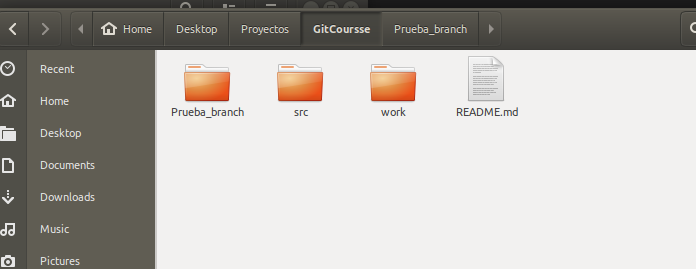
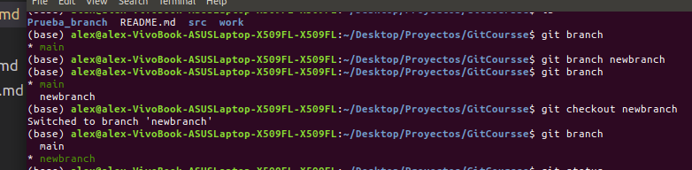
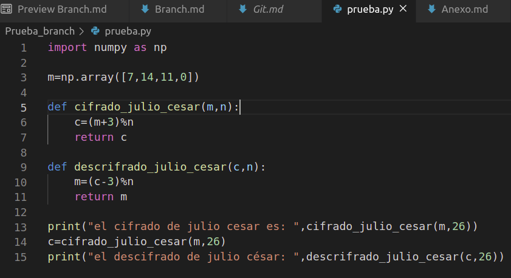
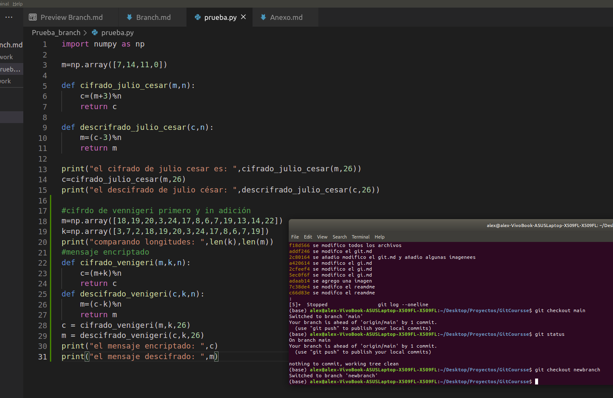
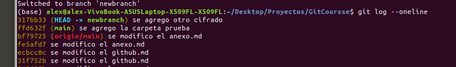
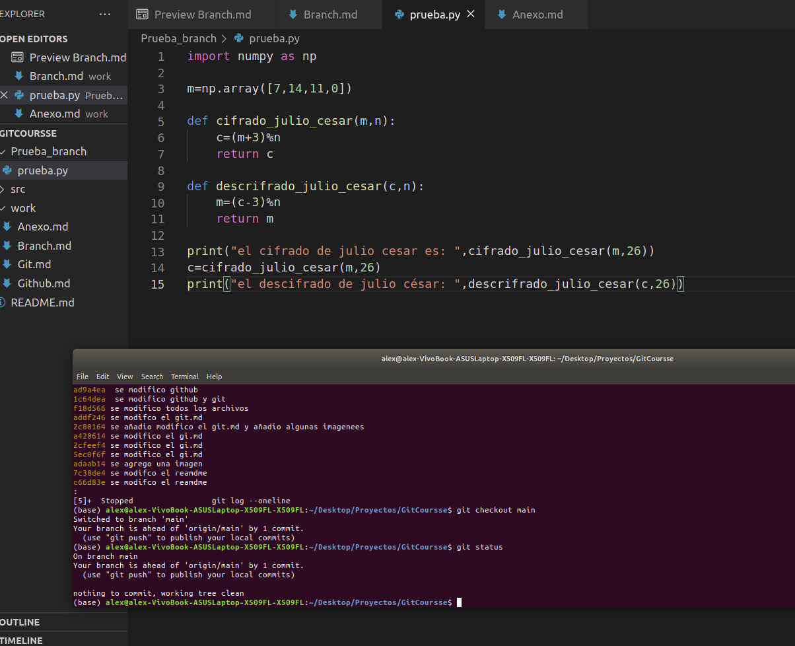
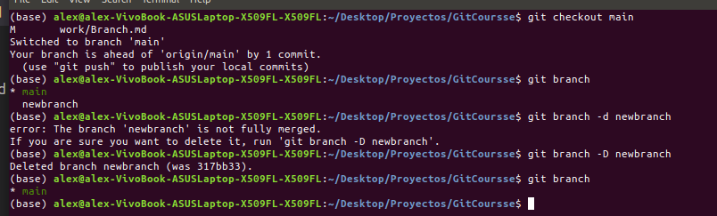

## Branch 👋

El termino de branch o rama se podria definir como la linea temporal a lo largo de nuestro trabajo.
No obstante nosotros podemos generar una rama a esta linea que parte de un commit en particular y generar
un trabajo parelo a la rama Master/Main , como se ve en la imagen.

una de las ventajas que puedes tener al utilizar es las branch puede ser al poder probar un cambio en el código sin 
alterar la rama principal , y también con la opción de volver a la rama principal o aplicar un merge , es muy útil cuando se trabaja con otros programadores.

## Ejemplo 

Se creo una carpeta prueba_branch en el trabajo y dentro de ella esta el archivo `prueba.py` como se ve en la imagen.

ahora en la terminal creamos una brach con el comando  `git branch` + Branchname , en este caso llamaremos mewbranch
siguiente a ello con `git branch` vemos las ramas creadas en este caso tenemos la main y newbranch , pero estamos ubicados en la branch main , entonces si queremos cambiarnos de branch  con el comando `git checkout`+name podemos cambiarnos como se ve en la imágen.

Si nos situamos en el algoritmo de  `prueba.py` este constara de una funcón de encriptamiento llamada cifrado de julio césar donde estamos situados en la main.

si nos cambiamos de rama y alteramos el archivo prueba tendremos.

utilizamos `git log --oneline` para ver el commit de la nueva rama

y ahora volvemos a la main y veremos 

y para borrar una branch con el comando `git branch -D` + name

