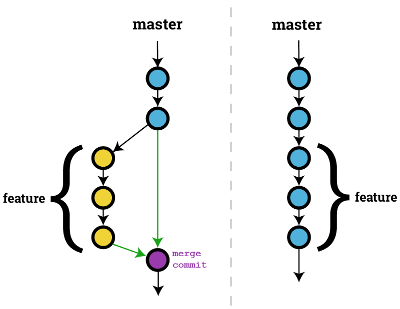

## Branch 👋

El termino de branch o rama se podria definir como la linea temporal a lo largo de nuestro trabajo.
No obstante nosotros podemos generar una rama a esta linea que parte de un commit en particular y generar
un trabajo parelo a la rama Master/Main , como se ve en la imagen.

una de las ventajas que puedes tener al utilizar es las branch puede ser al poder probar un cambio en el código sin 
alterar la rama principal , y también con la opción de volver a la rama principal o aplicar un merge.

