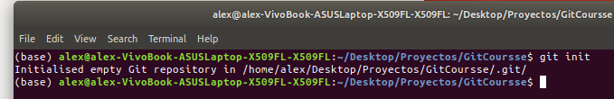
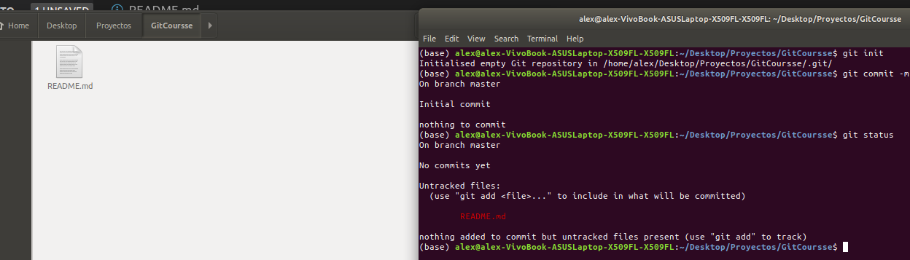
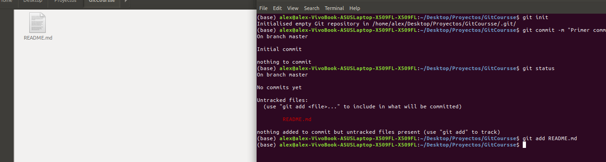

## Comandos de Git

## [Git Init](https://git-scm.com/docs/git-init) :

Con el comando git init lo que haremos sera un seguimiento de nuestro proyecto , este se realiza una solo vez y es al inicio del trabajo.

* Nota: De preferencia se usa al inicio pero se podria hacer en cualquier momento del proyecto.

Aquí podemos ver en la terminal el comando  ` git init `.

Inmediatamente se crea el git init lo que hace es crea 2 áreas donde se almacenaran los archivos las cuales son `staging area`  y `repository` como se ve en la imágen de abajo.

## Working directory :

En esta área se puede realizar los cambios que guste pero el git no los tomara en consideración como por ejemplo agregar un archivo.

* Nota : Con [git status](https://git-scm.com/docs/git-status) usted puede ver el estado de el repositorio como por ejemplo  si se agrego un archivo , se borro , etc.

## [Git add](https://git-scm.com/docs/git-add) :

con el comando git add estamos pasadon del  `Working Directory` al `staging area` puede aplicar estos comandos.

*  `git add filename` : Aquí agregamos solo un archivo individual del  `Working Directory` al `staging area` . 

*  `git add .` : Aquí agregamos todos los archivos del `Working Directory`  al `staging area`.

como puede ver aquí aplicando git add README.md estamos añadiendo el archivo y este pasa a ser seguido por git en  el 
`staging area` 

## Staging Area :

Esta es un área temporal donde se pasa de un archivo el cual no fue tomado en cuenta por el area de `Working Directory`
a un archivo al que le aplica el seguimiento gracias al comando `git add`  sin embargo no esta confirmado para eso se aplica el `git commit` el cual dara esa confirmación y pasara a la siguiente área.

## Repository :

