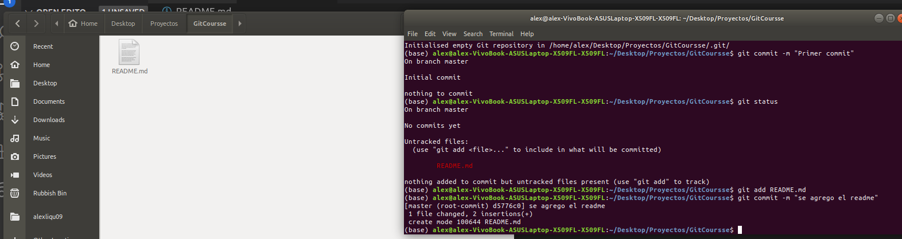

## Git  👋

Git (pronunciado "git"[aclaración requerida] 2​) es un software de control de versiones diseñado por Linus Torvalds, pensando en la eficiencia, la confiabilidad y compatibilidad del mantenimiento de versiones de aplicaciones cuando éstas tienen un gran número de archivos de código fuente , Wikipedia(2021).

## Iniciando trabajo en Git

Inmediatamente se crea el git init lo que hace es crea 2 áreas donde se almacenaran los archivos las cuales son `staging area`  y `repository` como se ve en la imágen de abajo.

## Working directory :

En esta área se puede realizar los cambios que guste pero el git no los tomara en consideración como por ejemplo agregar un archivo.

como puede ver aquí aplicando git add README.md estamos añadiendo el archivo y este pasa a ser seguido por git en  el 
`staging area` 

## Staging Area :

Esta es un área temporal donde se pasa de un archivo el cual no fue tomado en cuenta por el area de `Working Directory`
a un archivo al que le aplica el seguimiento gracias al comando `git add`  sin embargo no esta confirmado para eso se aplica el `git commit` el cual dara esa confirmación y pasara a la siguiente área.

## Repository :

En esta área es cuando se crea una copia del archivo de ese momento y esta listo para poder sincronizarse con [Github](https://github.com/alexliqu09/GitCourse/blob/main/work/Github.md).