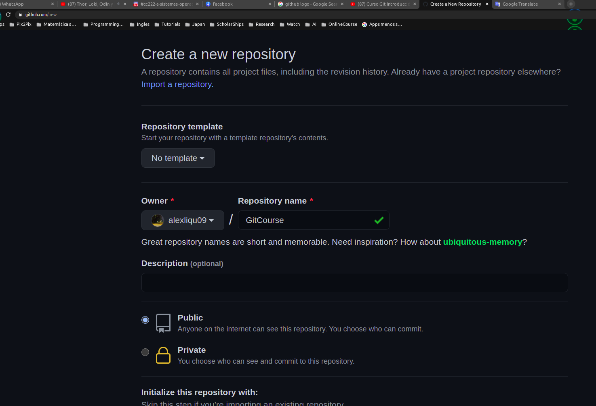
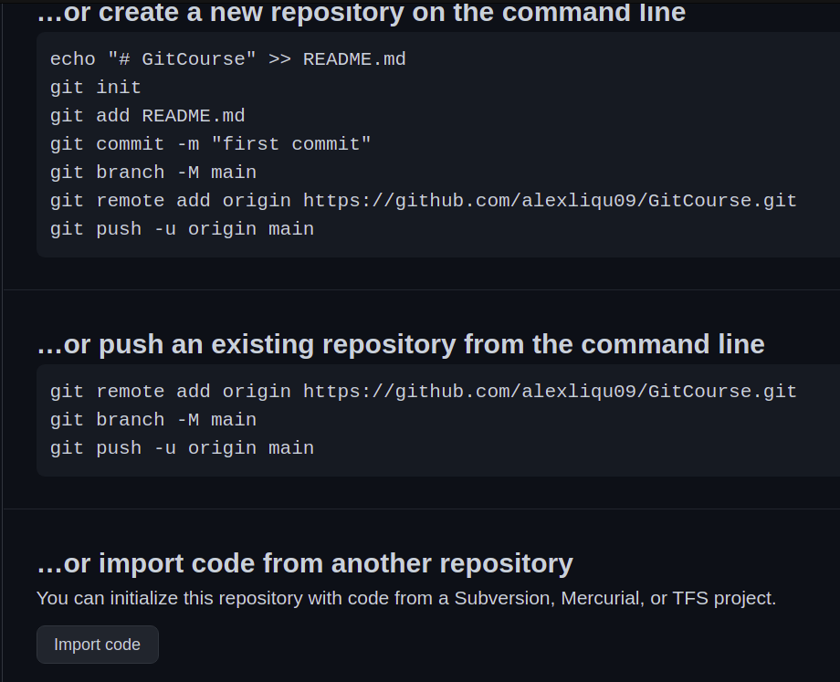
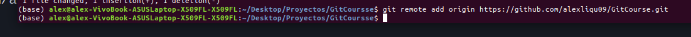
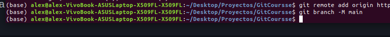
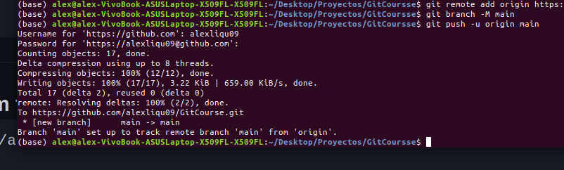

## Github  👋

GitHub es una forja (plataforma de desarrollo colaborativo) para alojar proyectos utilizando el sistema de control de versiones Git. Se utiliza principalmente para la creación de código fuente de programas de ordenador , Wikipedia(2021).

## Creación de Repositorio

Primero comenzaremos entrando en nuestro perfil en repositorios como se ve en la imagen.

Seleccionar el boton verde new.

Como se puede ver  en la imagende abajo debemos escribir el titulo del repositorio y posterior dar click en `create repository`.

Posterior a ello nos saldra esta ventan donde nosotros nos centraremos en el `or push an existing repository  from  the command line` , dado que queremos subir nuestro trabajo ha Github , para ello debemos utilizar los siguientes comandos de abajo.

Copiamos las los comandos en la terminal

Y con el comando `git push` se termina de subir todo nuestro trabajo.

